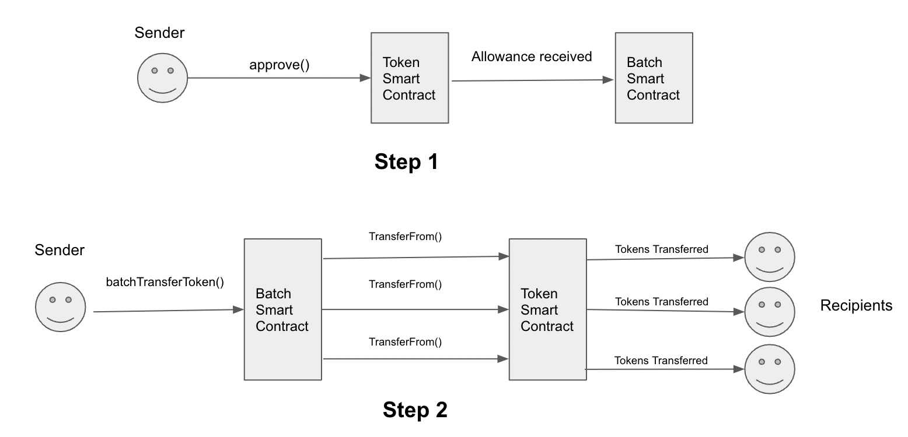

# Batch Transfer Contract

This smart contract is used to enable batch payments (Multiple recipients) in a single blockchain transaction. The tokens gets split and transferred to the respective recipients without involving a mediator.

The smart contract can be used to process payment transactions in a P2P way (Non Custodial) and a Payer can transfer to multiple Payees at once.

In order to save gas usage, the smart contract does not enforce additional checks such as sufficient balance check of tokens, sufficient check etc that anyways are part of the token transaction(ERC20 token) and the same can be checked in the application itself before executing the blockchain transaction (using the read only methods such as balanceOf etc which does not involves any gas usage). In case the required conditions are not met, the target smart contract (token contract) will revert the transaction automatically with a failure message.



## Methods

### Batch Transfer

The function `batchTransfer` transfers the native coins (such as ETH, Matic etc) from a single address to multiple destination addresses.

### Batch Transfer Token

The function `batchTransferToken` can be used for making a batch transaction involving single ERC20 token. In order to save gas, the function first adds the total required tokens, gets the same to the contract address using a one time `transferFrom` call and then splits (using `transfer` method) the respective tokens to the required number of recipients. This method is not intended to be used for deflationary tokens as the number of tokens transferred and received by the recipient can be different and the one time step of `transferFrom` method of the token to the contract and then splitting the same to multiple recipients will not work. For deflationary tokens, the other method `simpleBatchTransferToken` can be used.

### Simple Batch Transfer Token

The function `simpleBatchTransferToken` can be used for making a simple batch transaction involving single ERC20 token. The method directly uses `transferFrom` method of the target token contract for each recipient. This method also supports deflationary tokens as the one time step of using `transferFrom` to the contract itself is not there as in case of deflationary tokens the transferred amount may not be equal to the received amount.

### Batch Transfer Multi Token

The function `batchTransferMultiTokens` can be used for making batch transaction involving multiple ERC20 tokens.

### Batch Transfer Combined Multi Tokens

The function `batchTransferCombinedMultiTokens` can be used for a batch transaction involving a combination of multiple ERC20 tokens and native coin (eg: ETH).

## Requirements to run this repository

You can compile, run tests and deploy this smart contract with Hardhat.

- [Node.js](https://nodejs.org/download/release/v16.10.0/): `>=16.0.0`

- [Hardhat](https://docs.openzeppelin.com/upgrades-plugins/1.x/hardhat-upgrades): `v2.12.2`

## Usage

Clone or download this repository.

Go to path and run on terminal:

```sh

npm install

```

After running, all the dependencies will be downloaded.

You can also install hardhat as a global dependency by running:

```sh

npm install --save-dev hardhat

```

### Pre-requisites

---

Create .env file:

```

cp .env.template .env

```

Edit the below contents in .env file:

mainnet=`https://mainnet.infura.io/v3/Infura_key`

PRIVATE_KEY=`Wallet Private Key`

API_KEY= `EtherScan API key`

### Compile contracts

---

```sh

npx hardhat compile

```

After running, contract information including ABI will be available in the `artifacts/` directory.

### Run tests on Hardhat

---

You can run test-cases which can be found in the test directory `BatchContractHardhat/test` by running on the terminal:

```sh

npx hardhat test

```

---

**NOTE:**
_Kindly move the ‘Token.sol’ file from the ‘test’ folder to the ‘contracts’ folder while testing._

### Run migration and deploy contracts

---

Run deploy command:

```sh

npx hardhat run scripts/deploy.ts --network <network_name> // mainnet, rinkeby, goerli...

```

## License

SPDX-License-Identifier: MIT

###
